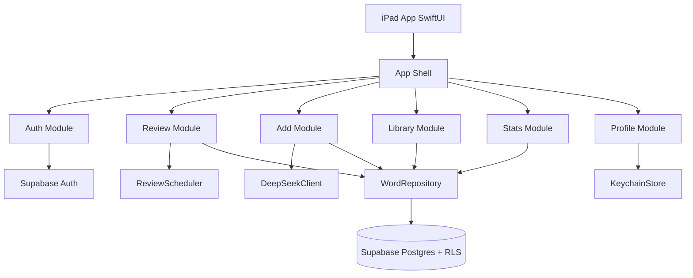

# Word Master iPad 架构设计（Phase 2）

- 日期：2026-03-11
- 对应需求基线：`docs/requirements.md`
- 目标：在 iPadOS（Swift Playgrounds）上交付联网背词应用，后端使用 Supabase，候选词使用 DeepSeek。

## 1. 技术栈与 Skill 基线校验

已安装并写入 `app-development-workflow/references/stack/STACK-SKILL-MAP.md`：

1. `swift_swiftui`
2. `supabase-postgres-best-practices`
3. `deepseek`

结论：架构技术选择（SwiftUI + Supabase + DeepSeek）与 Stack Skill 映射一致，满足 Phase 2 入口检查。

## 2. 总体架构

## 3. 模块划分表

| 模块 | 职责 | 输入 | 输出 |
|---|---|---|---|
| App Shell | 登录态守卫、5 Tab 导航、横竖屏布局切换 | Auth 状态 | 当前页面路由 |
| Auth Module | 账号密码登录、退出登录 | Email/Password | Session/User |
| Review Module | 今日队列、会/不会判定、阶段推进回退 | 词条、用户操作 | 词条状态更新、复习日志 |
| Add Module | 中文输入、DeepSeek 候选、手写兜底、去重合并 | 中文、用户选择/手写 | 词条新增或合并更新 |
| Library Module | 全词库展示、删除 | 用户词条集 | 列表视图与删除结果 |
| Stats Module | 总量/进行中/逾期/已掌握、阶段分布、时间轴 | 词条与日志 | 统计视图 |
| Profile Module | API Key 管理、退出登录 | API Key/操作 | Key 存储、登录态变化 |
| Data Layer | Supabase 访问封装、RLS 约束下查询 | 领域查询命令 | 领域模型数据 |

## 4. 数据模型（逻辑）

## 4.1 words

- `id: UUID`
- `user_id: UUID`
- `zh_text: String`
- `en_word: String`（同账号唯一）
- `stage: Int`（1...6）
- `next_review_date: Date`
- `is_mastered: Bool`
- `created_at/updated_at`

## 4.2 review_logs

- `id`
- `user_id`
- `word_id`
- `result: known | unknown`
- `from_stage`
- `to_stage`
- `reviewed_at`
- `next_review_date`

## 4.3 user_settings

- `user_id`
- `llm_provider`（固定 `deepseek`）
- `deepseek_api_key`（V1 建议本地 Keychain；如需云同步则加密）
- `updated_at`

## 5. 关键流程

## 5.1 登录流程

1. 启动时检查本地 Session。
2. 无 Session -> 登录页；有 Session -> 进入 Tab。
3. 调用 Supabase Auth 登录成功后刷新用户数据上下文。

## 5.2 复习流程

1. 拉取 `next_review_date <= today` 全部词条作为今日队列。
2. 展示中文卡片。
3. 未点“英文翻译”直接点卡片 -> `known`：阶段 `min(stage+1, 6)`。
4. 点“英文翻译”后再点卡片 -> `unknown`：阶段回退到 `1`。
5. 新 `next_review_date`：按 `1/2/4/7/15/30` 规则计算；`unknown` 固定为第二天。
6. 写入 `words` 与 `review_logs`。

## 5.3 添加流程

1. 输入中文 -> 调用 DeepSeek 返回候选英文数组。
2. 用户点选候选或手写英文。
3. 保存时按 `(user_id, en_word)` 去重：命中则合并更新并提示，未命中则新增。
4. 首次复习日期固定为第二天，初始阶段为 1。

## 6. iPad 交互与方向策略

1. 支持竖屏与横屏两种方向，旋转时保持当前业务状态不丢失。
2. 优先使用 iPad 常见交互：清晰分区、可点按区域、语义化导航层级。
3. 统计页图表在横屏可展示更宽布局，竖屏自动折叠为纵向信息块。

## 7. 关键 ADR

## ADR-001：V1 仅 iPadOS，联网，不做离线

- 决策：不引入离线同步复杂度，优先完成在线闭环。
- 原因：范围控制，降低首版失败风险。

## ADR-002：账号策略为“仅登录，不注册”

- 决策：账号由管理员在 Supabase 预创建。
- 原因：目标用户是高中生，简化首次接入和账号治理。

## ADR-003：单义词条模型

- 决策：一个中文词条只对应一个英文单词。
- 原因：复习判定路径简单、统计口径清晰。

## ADR-004：候选词服务选 DeepSeek

- 决策：中文输入后由 DeepSeek 返回候选数组，支持手写兜底。
- 原因：满足“候选 + 选择”需求，且便于后续升级提示词策略。

## ADR-005：同账号英文词重复采用“合并更新”

- 决策：命中重复英文词不新增，执行合并更新并提示。
- 原因：避免重复数据导致复习与统计偏差。

## ADR-006：数据隔离依赖 Supabase RLS

- 决策：所有业务表开启 RLS，按 `auth.uid() = user_id` 约束读写。
- 原因：保证不同账号数据隔离。

## 8. 风险与回滚（Phase 2）

1. 风险：DeepSeek 请求失败影响添加流程。  
回滚：保留手写英文兜底，候选失败不阻塞新增。
2. 风险：复习算法实现偏差。  
回滚：先锁定到最小规则（会+1，不会->1，次日复习）并回归验证。
3. 风险：RLS 策略误配。  
回滚：暂停写操作，快速核对策略后恢复。

## 9. 后续文档计划

- Supabase 详细配置指南将作为独立文档补充：`docs/supabase-setup.md`（按你的要求后续提供）。

## 10. approval_record

| 字段 | 内容 |
|---|---|
| phase | 2 |
| decision | 通过 |
| decided_by | user |
| decided_at | 2026-03-11T21:06:38.0672377+08:00 |
| notes | 用户回复“通过” |

## 11. rejection_record

| round | reason | action |
|---|---|---|
| 1 | 提出两条流程优化建议：`STACK-SKILL-MAP` 缺失时先查找替换；Phase 2 先签核架构再产出计划 | 按用户最新指令仅将优化建议写入 `flow-optimization-log.md`，不改原流程，随后重新提交阶段签核 |
